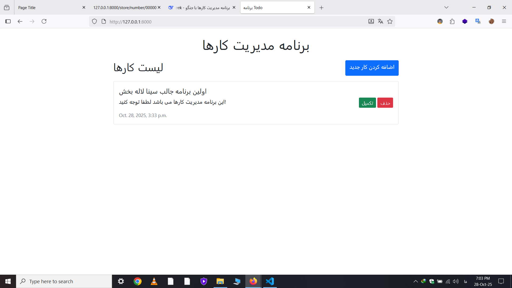

1. 
pipenv install django
2. 
pipenv shell
3. 
django-admin startproject config .
4.
python manage.py startapp todo
5.
python manage.py makemigrations
6.
python manage.py migrate
7.
python manage.py createsuperuser
8.
python manage.py runserver

